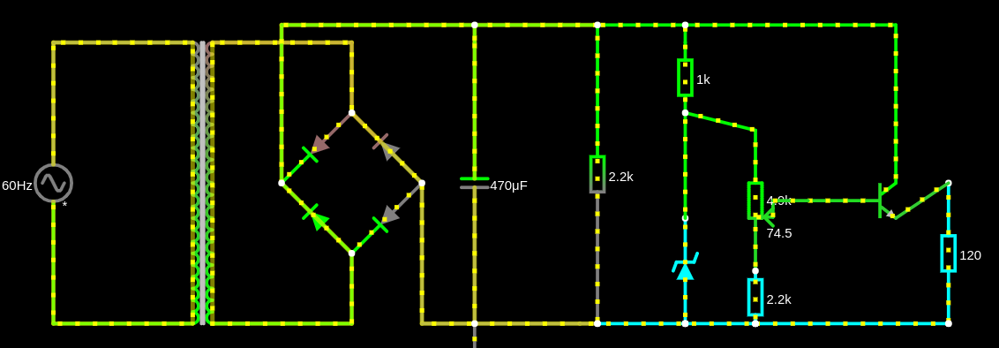

# Fonte de Tensão

## Projeto do circuito
### No Falstad

[Source](https://tinyurl.com/23wuzbmm  "Circuito no Falstad")

### No PCB
(INSERIR AQUI FOTO DO ESQUEMÁTICO)

(INSERIR AQUI LINK DO ESQUEMÁTICO)

## Componentes
| **Quantidade** | **Item **         | **Preço**    |
|----------------|-------------------|--------------|
| 4              | Diodo 1N4001      | R$= 0,80     |
| 1              | Capacitor 470uF   | R$=1,40      |
| 1              | Resistor 1k ohm   | R$=0,20      |
| 1              | Resistor 120 ohm  | R$=0,09      |
| 2              | Resistor 2.2k     | R$=0,14      |
| 1              | Potenciômetro 5k  | R$=2,21      |
| 1              | Diodo Zener (13v) | R$=0,14      |
| 1              | TransistorNpnBc548| R$=0,30      |
| **Total:**     |                   | **R$=5,28** |

## Funcionamento da Fonte
(INSERIR AQUI FOTOS DA PROTOBOARD POR VÁRIOS ÂNGULOS)

(INSERIR AQUI VIDEO DA FONTE FUNCIONANDO)

## Creditos
Pedro Henrique Cavalcante Lima [(Git)](https://github.com/CallofSilverwing "Git do Pedro")

Jean Patrick Ngandu Mamani [(Git)](https://tinyurl.com/23wuzbmm  "Git do Jean")

Thales Sena de Queiroz [(Git)](https://github.com/TaresuSenu "Git do Thales")
