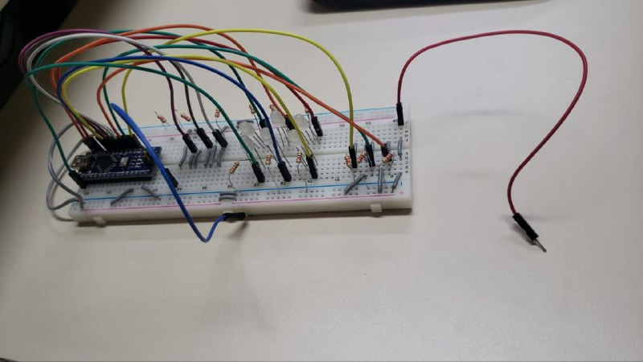
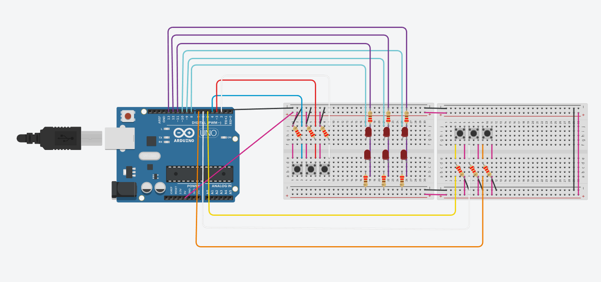

# Projeto Arduino Pedra-Papel-Tesoura

## Representação do Circuito
### Software
[Code](code/programa_eletronica.cpp)

### Conexões com o Arduino

[Tinkercad](https://www.tinkercad.com/things/c0FkMkoZxGr "Circuito no Tinkercad")

## Funcionamento do Circuito
[Video](https://drive.google.com/file/d/1tdzCcuPE3OAWhR-oipB0QpGcustWnh78/view)

## Creditos
Pedro Henrique Cavalcante Lima [(Github)](https://github.com/CallofSilverwing)

Jean Patrick Ngandu Mamani [(Github)](https://github.com/JeanJPNM)

Thales Sena de Queiroz [(Github)](https://github.com/TaresuSenu)

