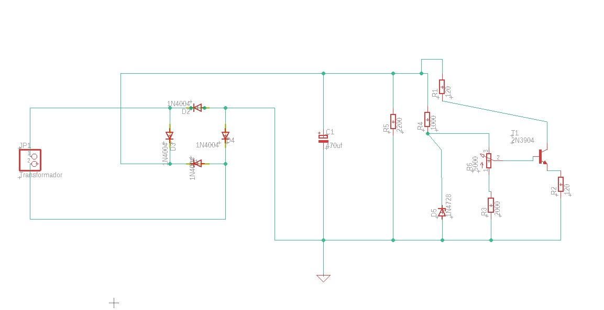

# Fonte de Tensão

## Projeto do circuito
### No Falstad

[Source](https://tinyurl.com/28r93ss3  "Circuito no Falstad")

### No PCB

### No Eagle

## Componentes
| **Quantidade** | **Item **         | **Preço**    |
|----------------|-------------------|--------------|
| 4              | Diodo 1N4001      | R$= 0,80     |
| 1              | Capacitor 470uF   | R$=1,40      |
| 3              | Resistor 1k ohm   | R$=0,60      |
| 2              | Resistor 120 ohm  | R$=0,18      |
| 1              | Resistor 2.2k     | R$=0,07      |
| 1              | Potenciômetro 5k  | R$=2,28      |
| 1              | Diodo Zener (13v) | R$=0,50      |
| 1              | Transistor 2N3904 | R$=1,60      |
| **Total:**     |                   | **R$=7,36**  |

## Funcionamento da Fonte
[(Video)](https://drive.google.com/file/d/193sPUEtSzviEUPhtPoBulQr0Xd0gNCkq/view?usp=sharing)
No final a resistencia de 2000 se tornou uma de 1107,04 pois foi conectado um resistor 120 paralelo a um dos de 1k ficando em serie com o outro de 1k, pois com 2000 a ddp estava chegando somente ate 3.2V e com essa mudança chegou até 1.9. Gostaria de agradecer ao Grande Mestre Simões.
## Creditos
Pedro Henrique Cavalcante Lima [(Github)](https://github.com/CallofSilverwing)

Jean Patrick Ngandu Mamani [(Github)](https://github.com/JeanJPNM)

Thales Sena de Queiroz [(Github)](https://github.com/TaresuSenu)
